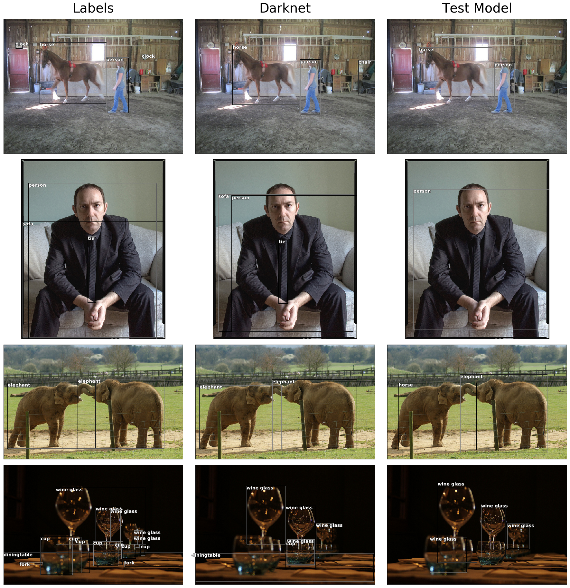

# YoloV3 in Pytorch and Jupyter Notebook

  

This repository aims to create a YoloV3 detector in **Pytorch** and **Jupyter Notebook**. I'm trying to take a more "oop" approach compared to other existing implementations which constructs the architecture iteratively by reading the config file at [Pjreddie's repo](https://github.com/pjreddie/darknet/blob/master/cfg/yolov3.cfg). The notebook is intended for study and practice purpose, many ideas and code snippets are taken from various papers and blogs. I will try to comment as much as possible. You should be able to just *Shift-Enter* to the end of the notebook and see the results.

## Requirements

 - Python 3.6.4
 - Pytorch 0.4.0
 - Jupyter Notebook 5.4.0
 - OpenCV 3.4.0
 - imgaug 0.2.6
 - Cuda Support

## Instructions
    $ git clone https://github.com/ydixon/yolo_v3
    $ cd yolo_v3
##### Download Yolo v3 weights
	$ wget https://pjreddie.com/media/files/yolov3.weights
##### Download Darknet53 weights
	$ wget https://pjreddie.com/media/files/darknet53.conv.74
##### Download COCO
    $ cd data/
    $ bash get_coco_dataset.sh

## How to use
These notebooks are intended to be self-sustained as possible as they could be, so you can just step through each cell and see the results. However, for the later notebooks, they will import classes that were built before. It's recommended to go through the notebooks in order.
### yolo_detect.ipynb [view](http://nbviewer.jupyter.org/github/ydixon/yolo_v3/blob/master/yolo_detect.ipynb)
This notebook takes you through the steps of building the darknet53 backbone network, yolo detection layer and all the way up to objection detection from scratch.
<pre>
&#8226; Conv-bn-Relu Blocks				&#8226; Residual Blocks
&#8226; Darknet53					&#8226; Upsample Blocks
&#8226; Yolo Detection Layer				&#8226; Letterbox Transforms
&#8226; Weight Loading				&#8226; Bounding Box Drawing
&#8226; IOU - Jaccard Overlap				&#8226; Non-max suppression (NMS)
</pre>
### Data_Augmentation.ipynb [view](http://nbviewer.jupyter.org/github/ydixon/yolo_v3/blob/master/Data_Augmentation.ipynb)
Show case augmentations used by the darknet cfg file including `hue`, `saturation`, `exposure`, `jitter` parameters. Also demo additional augmentations that could be used for different kinds of datasets such as `rotation`, `shear`, `zoom`, `Gaussian noises`, `blurring`, `sharpening effect`, etc. Most of the augmentations would be powered by the [imgaug](https://github.com/aleju/imgaug) library. This notebook will also show how to integrate these augmentations into Pytorch datasets. 

Augmentation | Description | Parameter |
--- | --- | --- |
Random Crop | +/- 30% (top, right, bottom, left) | `jitter`
Letterbox | Keep aspect ratio resize, pad with gray color | N/A
Horizontal Flip | 50% chance | N/A
**H**SV Hue | Add +/- `179 * hue` | `hue` 
H**S**V Saturation | Multiply `1/sat` ~ `sat` | `saturation`
HS**V** Exposure | Multiply `1/exposure` ~ `exposure` |`exposure`

### Deterministic_data_loading.ipynb [view](http://nbviewer.jupyter.org/github/ydixon/yolo_v3/blob/master/Deterministic_data_loading.ipynb)
Pytorch's `Dataset` and `DataLoader` class are easy and convenient to use. It does a really good job in abstracting the multiprocessing behind the scenes. However, the design also poses certain limitations when users try to add more functionalities. This notebook aims to address some of these concerns:
1. Resume-able between batches
2. Deterministic - results reproducible whether is has been paused/resume/one go.
3. Reduced time for first batch - by default the `Dataloader` would need to iterate up to all the batches that came before the 'To-be-resumed batch' and that could take hours for long datasets.
4. Cyclic - pick up left over samples that were not sufficient enough to form a batch and combine them with samples from the next epoch.

### COCODataset.ipynb [view](http://nbviewer.jupyter.org/github/ydixon/yolo_v3/blob/master/COCODataset.ipynb)
Shows how to parse the COCO dataset that follows the format that was used in the original darknet implementation .
<pre>
&#8226; Generate labels			&#8226; Image loading
&#8226; Convert labels and image to Tensors	&#8226; Box coordinates transforms
&#8226; Build Pytorch dataset			&#8226; Draw
</pre>

  

### yolo_train.ipynb [view](http://nbviewer.jupyter.org/github/ydixon/yolo_v3/blob/master/yolo_train.ipynb)
Building up on previous notebooks, this notebook implements the back-propagation and training process of the network. The most important part is figuring out how to convert labels to target masks and tensors that could be trained against. This notebook also modifies `YoloNet` a little bit to accommodate the changes.
<pre>
&#8226; Multi-box IOU 			&#8226; YoloLoss
&#8226; Build truth tensor			&#8226; Generate masks
&#8226; Loss function				&#8226; Differential learning rates
&#8226; Intermediate checkpoints		&#8226; Train-resuming
</pre>
**Updated to use mseloss for tx, ty. This should improve training performance.**
### yolo_train_short.ipynb [view](http://nbviewer.jupyter.org/github/ydixon/yolo_v3/blob/master/yolo_train_short.ipynb)
Minimal version of **yolo_train.ipynb**. You can use this notebook if you are only interested in testing with different datasets/augmentations/loss functions.

  

### CVATDataset.ipynb [view](http://nbviewer.jupyter.org/github/ydixon/yolo_v3/blob/master/CVATDataset.ipynb)
After using [CVAT](https://github.com/opencv/cvat) to create labels, this notebook will parse the CVAT label format(xml) and convert it to readable format by the network. We will also start using openCV to draw and save image because **openCV** deals with pixels instead of DPI compared to **PLT** library which is more convenient. 

  

### cvat_data_train.ipynb [view](http://nbviewer.jupyter.org/github/ydixon/yolo_v3/blob/master/cvat_data_train.ipynb)
Data is obtained by extracting images from a clip in **Star Wars: Rogue One** with ffmpeg. There are around 300 images and they are annotated by using CVAT. The notebook will simply overfit the model with custom data while using the darknet53 as feature extraction.  
**P.S I used this notebook as sanity test for yolo_train.ipynb while I was experimenting with the loss function**
## Progress
**2018/8/30: Uploaded data/annotations for custom_data_train.ipynb. All notebooks should be working now**  
**2018/9/11: Adapt data augmentations**  
**2018/9/30: New loss function. Adapt darknet cfg augmentations parameters**  
**2018/11/04: Accumlated gradients. Support use of `subdivisions` for GPU with less memory**  
**2018/12/15: Multi-scale training. New `DataHelper` class for batch scheduling. `custom_data_train.ipynb` replaced by `cvat_data_train.ipynb`. Deterministic data loading with Pytorch's dataset/dataloader. Training now resume-able between batches instead of epochs while maintaining deterministic behavior.**  

TODO:
 1. Multi-scale training
 2. mAP (mean average precision)
 3. Data augmentation (random crop, rotate)
 4. Implement backhook for YoloNet branching
 5. Feed Video to detector
 6. Fix possible CUDA memory leaks
 7. Fix class and variable names

## References

1. [YOLOv3_: An Incremental Improvement. Joseph Redmon, Ali Farhadi ](https://pjreddie.com/media/files/papers/YOLOv3.pdf) 
2. [Darknet Github Repo](https://github.com/pjreddie/darknet)
3. [Fastai](http://www.fast.ai/)
4. [Pytorch Implementation of Yolo V3](https://github.com/ayooshkathuria/pytorch-yolo-v3)
5. [Deep Pyramidal Residual Networks](https://arxiv.org/abs/1610.02915)
6. [eriklindernoren's Repo](https://github.com/eriklindernoren/PyTorch-YOLOv3)
7. [BobLiu20's Repo](https://github.com/BobLiu20/YOLOv3_PyTorch)
