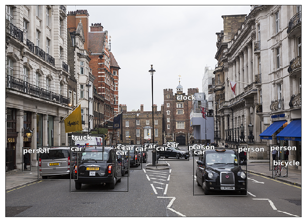

# YoloV3 in Pytorch and Jupyter Notebook

  

This repository aims to create a YoloV3 detector in **Pytorch** and **Jupyter Notebook**. I'm trying to take a more "oop" approach compared to other existing implementations which constructs the architecture iteratively by reading the config file at [Pjreddie's repo](https://github.com/pjreddie/darknet/blob/master/cfg/yolov3.cfg). The notebook is intended for study and practice purpose, many ideas and code snippets are taken from various papers and blogs. I will try to comment as much as possible. You should be able to just *Shift-Enter* to the end of the notebook and see the results.

# Requirements

 - Python 3.6.4
 - Pytorch 0.4.0
 - Jupyter Notebook 5.4.0
 - OpenCV 3.4.0
 - Cuda Support

# Progress
Just finished forward pass. Moving to back-propagation soon.

 **Completed:**
 1. Basic Conv Blocks
 2. Residual Blocks
 3. Image Loading
 4. Darknet53
 5. Upsample
 6. Add route layer support for Darknet53
 7. Map2cfg - support indexing scheme from cfg file
 8. Yolo Detection Layer
 9. Weight Loading
 10. Bounding Box Drawing
 11. Letterbox Transforms
 12. IOU - Jaccard Overlap
 13. Non-max suppression (NMS)
 14. Post-processing from network output
 15. Dataset to read from folder

 **To Do:**
  1. Color palette for bounding boxes
  2. Imaging saving
  3. Feed Video to detector
  4. Fix possible CUDA memory leaks
  5. Fix class and variable names
  6. Training
	  1. Loss Function
	  2. Parse COCO/VOC dataset
	  3. Add new classes to the detector

## References

1. [YOLOv3_: An Incremental Improvement. Joseph Redmon, Ali Farhadi ](https://pjreddie.com/media/files/papers/YOLOv3.pdf) 
2. [Darknet Github Repo](https://github.com/pjreddie/darknet)
3. [Fastai](http://www.fast.ai/)
4. [Pytorch Implementation of Yolo V3](https://github.com/ayooshkathuria/pytorch-yolo-v3)
5. [Deep Pyramidal Residual Networks](https://arxiv.org/abs/1610.02915)
